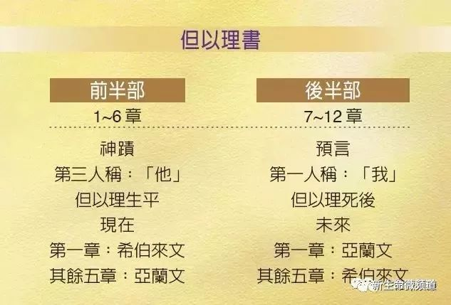
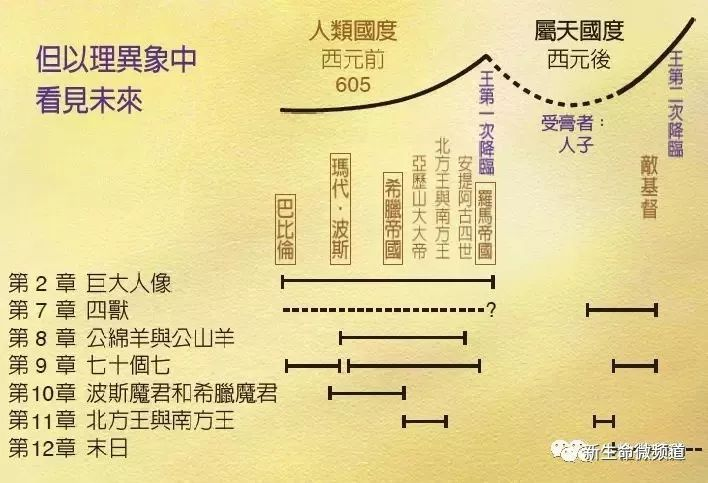

---
# You can also start simply with 'default'
theme: apple-basic
# random image from a curated Unsplash collection by Anthony
# like them? see https://unsplash.com/collections/94734566/slidev
background: https://cover.sli.dev
# some information about your slides (markdown enabled)
title: Daniel II
info: Bobson Lin / Sep. 20th 2024
# apply unocss classes to the current slide
# class: text-center
# https://sli.dev/features/drawing
drawings:
  persist: false
# slide transition: https://sli.dev/guide/animations.html#slide-transitions
transition: slide-left
# enable MDC Syntax: https://sli.dev/features/mdc
mdc: true

layout: intro
---

<h1 flex="~ col">

聖經人物

但以理 II

</h1>

  
    Bobson Lin
  
  
    Sep. 20th 2024
  

<!--
The last comment block of each slide will be treated as slide notes. It will be visible and editable in Presenter Mode along with the slide. [Read more in the docs](https://sli.dev/guide/syntax.html#notes)
-->

---
layout: intro
---

# Presentation title

Presentation subtitle

  
    Author and Date
  

---
layout: statement
---

## 背景

---
layout: statement
---

## 背景

---
layout: statement
---

## 但以理看見 (但以理書 7-12)

---
layout: image-right
image: '/image/path'
---

# 但以理的特質 Ⅰ
## 立志不妥協的人

* 但 1:8
8 但以理卻立志，不以王的膳和王所飲的酒玷污自己，於是懇求太監長容他不使自己玷污。
* 箴 4:23 
23你要保守你心，勝過保守一切，
因為生命的泉源由心發出。

在小事上堅守原則 (對上帝忠心)
在大事上不會動搖 (對上帝恩典)

---
layout: image-right
image: '/image/path'
---

# 但以理的特質 Ⅱ
## 有美好靈性的人

當代譯本 - 非凡的心智、知識和悟性

* 但 5:12
 5在他裏頭有美好的靈性，又有知識聰明，能圓夢，釋謎語，解疑惑。這人名叫但以理，尼布甲尼撒王又稱他為伯提沙撒，現在可以召他來，他必解明這意思。」
* 但 4:8-9
 8末後那照我神的名，稱為伯提沙撒的但以理來到我面前，他裏頭有聖神的靈，我將夢告訴他說： 9『術士的領袖伯提沙撒啊，因我知道你裏頭有聖神的靈，甚麼奧祕的事都不能使你為難。現在要把我夢中所見的異象和夢的講解告訴我。』
* 但 6:3
 3因這但以理有美好的靈性，所以顯然超乎其餘的總長和總督，王又想立他治理通國。

---
layout: image-right
image: '/image/path'
---

# 但以理的特質 Ⅲ
## 凡事禱告的人

* 但 6:10
10但以理知道這禁令蓋了玉璽，就到自己家裏（他樓上的窗戶開向耶路撒冷），一日三次，雙膝跪在他神面前，禱告感謝，與素常一樣。
* 但 9:3-4
3我便禁食，披麻蒙灰，定意向主神祈禱懇求。 4我向耶和華－我的神祈禱、認罪，說：「主啊，大而可畏的神，向愛主、守主誡命的人守約施慈愛。

---
layout: image-right
image: '/image/path'
---

# 但以理的特質 Ⅳ
## 大蒙眷愛的人

* 但 10:11
11他對我說：「大蒙眷愛的但以理啊，要明白我與你所說的話，只管站起來，因為我現在奉差遣來到你這裏。」他對我說這話，我便戰戰兢兢地站起來。
* 但 10:19
19他說：「大蒙眷愛的人哪，不要懼怕，願你平安！你所要的，你要剛強壯膽！」他說話，我便覺得有力量，說：「我主說話，我僕人可以說話，我已經疲乏，渾身無力。」

---
layout: outro

# 思考與分享

* 你有什麼原則是不會妥協的？
