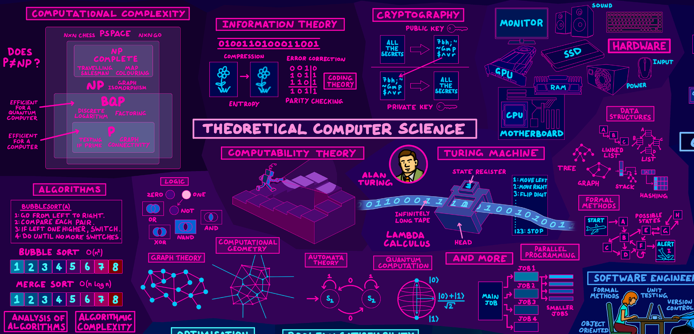
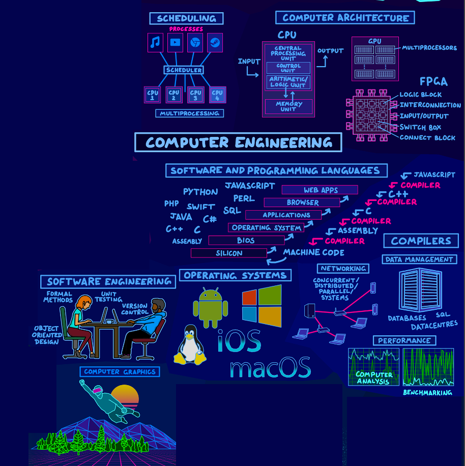

<h1 flex="~ col">

 
資訊知多少

資工系在幹嘛?

</h1>

  
 Bobson Lin

  
Oct. 27th 2024

---
class: flex justify-center items-center gap-20 px40 text-3xl
glow: bottom
---

<v-clicks>

1. 生活中有哪些科技產品讓你們感到驚奇?
2. 這些科技產品是如何運作的？

</v-clicks>

---
glow: left
---

Application

<svg xmlns="http://www.w3.org/2000/svg" width="26.01" height="32" viewBox="0 0 256 315"><path fill="white" d="M213.803 167.03c.442 47.58 41.74 63.413 42.197 63.615c-.35 1.116-6.599 22.563-21.757 44.716c-13.104 19.153-26.705 38.235-48.13 38.63c-21.05.388-27.82-12.483-51.888-12.483c-24.061 0-31.582 12.088-51.51 12.871c-20.68.783-36.428-20.71-49.64-39.793c-27-39.033-47.633-110.3-19.928-158.406c13.763-23.89 38.36-39.017 65.056-39.405c20.307-.387 39.475 13.662 51.889 13.662c12.406 0 35.699-16.895 60.186-14.414c10.25.427 39.026 4.14 57.503 31.186c-1.49.923-34.335 20.044-33.978 59.822M174.24 50.199c10.98-13.29 18.369-31.79 16.353-50.199c-15.826.636-34.962 10.546-46.314 23.828c-10.173 11.763-19.082 30.589-16.678 48.633c17.64 1.365 35.66-8.964 46.64-22.262"/></svg>

<svg xmlns="http://www.w3.org/2000/svg" width="32" height="32" viewBox="0 0 256 256"><path fill="#F1511B" d="M121.666 121.666H0V0h121.666z"/><path fill="#80CC28" d="M256 121.666H134.335V0H256z"/><path fill="#00ADEF" d="M121.663 256.002H0V134.336h121.663z"/><path fill="#FBBC09" d="M256 256.002H134.335V134.336H256z"/></svg>

<svg xmlns="http://www.w3.org/2000/svg" width="31.27" height="32" viewBox="0 0 256 262"><path fill="#4285F4" d="M255.878 133.451c0-10.734-.871-18.567-2.756-26.69H130.55v48.448h71.947c-1.45 12.04-9.283 30.172-26.69 42.356l-.244 1.622l38.755 30.023l2.685.268c24.659-22.774 38.875-56.282 38.875-96.027"/><path fill="#34A853" d="M130.55 261.1c35.248 0 64.839-11.605 86.453-31.622l-41.196-31.913c-11.024 7.688-25.82 13.055-45.257 13.055c-34.523 0-63.824-22.773-74.269-54.25l-1.531.13l-40.298 31.187l-.527 1.465C35.393 231.798 79.49 261.1 130.55 261.1"/><path fill="#FBBC05" d="M56.281 156.37c-2.756-8.123-4.351-16.827-4.351-25.82c0-8.994 1.595-17.697 4.206-25.82l-.073-1.73L15.26 71.312l-1.335.635C5.077 89.644 0 109.517 0 130.55s5.077 40.905 13.925 58.602z"/><path fill="#EB4335" d="M130.55 50.479c24.514 0 41.05 10.589 50.479 19.438l36.844-35.974C195.245 12.91 165.798 0 130.55 0C79.49 0 35.393 29.301 13.925 71.947l42.211 32.783c10.59-31.477 39.891-54.251 74.414-54.251"/></svg>

<svg xmlns="http://www.w3.org/2000/svg" width="47.91" height="32" viewBox="0 0 256 171"><defs><linearGradient id="logosMetaIcon0" x1="13.878%" x2="89.144%" y1="55.934%" y2="58.694%"><stop offset="0%" stop-color="#0064E1"/><stop offset="40%" stop-color="#0064E1"/><stop offset="83%" stop-color="#0073EE"/><stop offset="100%" stop-color="#0082FB"/></linearGradient><linearGradient id="logosMetaIcon1" x1="54.315%" x2="54.315%" y1="82.782%" y2="39.307%"><stop offset="0%" stop-color="#0082FB"/><stop offset="100%" stop-color="#0064E0"/></linearGradient></defs><path fill="#0081FB" d="M27.651 112.136c0 9.775 2.146 17.28 4.95 21.82c3.677 5.947 9.16 8.466 14.751 8.466c7.211 0 13.808-1.79 26.52-19.372c10.185-14.092 22.186-33.874 30.26-46.275l13.675-21.01c9.499-14.591 20.493-30.811 33.1-41.806C161.196 4.985 172.298 0 183.47 0c18.758 0 36.625 10.87 50.3 31.257C248.735 53.584 256 81.707 256 110.729c0 17.253-3.4 29.93-9.187 39.946c-5.591 9.686-16.488 19.363-34.818 19.363v-27.616c15.695 0 19.612-14.422 19.612-30.927c0-23.52-5.484-49.623-17.564-68.273c-8.574-13.23-19.684-21.313-31.907-21.313c-13.22 0-23.859 9.97-35.815 27.75c-6.356 9.445-12.882 20.956-20.208 33.944l-8.066 14.289c-16.203 28.728-20.307 35.271-28.408 46.07c-14.2 18.91-26.324 26.076-42.287 26.076c-18.935 0-30.91-8.2-38.325-20.556C2.973 139.413 0 126.202 0 111.148z"/><path fill="url(#logosMetaIcon0)" d="M21.802 33.206C34.48 13.666 52.774 0 73.757 0C85.91 0 97.99 3.597 110.605 13.897c13.798 11.261 28.505 29.805 46.853 60.368l6.58 10.967c15.881 26.459 24.917 40.07 30.205 46.49c6.802 8.243 11.565 10.7 17.752 10.7c15.695 0 19.612-14.422 19.612-30.927l24.393-.766c0 17.253-3.4 29.93-9.187 39.946c-5.591 9.686-16.488 19.363-34.818 19.363c-11.395 0-21.49-2.475-32.654-13.007c-8.582-8.083-18.615-22.443-26.334-35.352l-22.96-38.352C118.528 64.08 107.96 49.73 101.845 43.23c-6.578-6.988-15.036-15.428-28.532-15.428c-10.923 0-20.2 7.666-27.963 19.39z"/><path fill="url(#logosMetaIcon1)" d="M73.312 27.802c-10.923 0-20.2 7.666-27.963 19.39c-10.976 16.568-17.698 41.245-17.698 64.944c0 9.775 2.146 17.28 4.95 21.82L9.027 149.482C2.973 139.413 0 126.202 0 111.148C0 83.772 7.514 55.24 21.802 33.206C34.48 13.666 52.774 0 73.757 0z"/></svg>

<svg xmlns="http://www.w3.org/2000/svg" width="32" height="32" viewBox="0 0 24 24"><path fill="red" d="m12 5.362l2.475-3.026s4.245.09 8.471 2.054c-1.082 1.636-3.231 2.438-3.231 2.438c-.146-1.439-1.154-1.79-4.354-1.79L12 24L8.619 5.034c-3.18 0-4.188.354-4.335 1.792c0 0-2.146-.795-3.229-2.43C5.28 2.431 9.525 2.34 9.525 2.34zl-.004.002H12zm0-3.899c3.415-.03 7.326.528 11.328 2.28c.535-.968.672-1.395.672-1.395C19.625.612 15.528.015 12 0C8.472.015 4.375.61 0 2.349c0 0 .195.525.672 1.396C4.674 1.989 8.585 1.435 12 1.46z"/></svg>

<svg xmlns="http://www.w3.org/2000/svg" width="32" height="32" viewBox="0 0 24 24"><path fill="currentColor" d="M24 7.417C8.882 8.287 1.89 14.75.321 16.28L0 16.583h2.797C10.356 9.005 21.222 7.663 24 7.417m-17.046 6.35c-.472.321-.945.68-1.398 1.02l2.457 1.796h2.778zM2.948 10.8H.189l3.25 2.381c.473-.321 1.02-.661 1.512-.945Z"/></svg>

<svg xmlns="http://www.w3.org/2000/svg" width="32" height="32" viewBox="0 0 24 24"><path fill="currentColor" d="M22.282 9.821a6 6 0 0 0-.516-4.91a6.05 6.05 0 0 0-6.51-2.9A6.065 6.065 0 0 0 4.981 4.18a6 6 0 0 0-3.998 2.9a6.05 6.05 0 0 0 .743 7.097a5.98 5.98 0 0 0 .51 4.911a6.05 6.05 0 0 0 6.515 2.9A6 6 0 0 0 13.26 24a6.06 6.06 0 0 0 5.772-4.206a6 6 0 0 0 3.997-2.9a6.06 6.06 0 0 0-.747-7.073M13.26 22.43a4.48 4.48 0 0 1-2.876-1.04l.141-.081l4.779-2.758a.8.8 0 0 0 .392-.681v-6.737l2.02 1.168a.07.07 0 0 1 .038.052v5.583a4.504 4.504 0 0 1-4.494 4.494M3.6 18.304a4.47 4.47 0 0 1-.535-3.014l.142.085l4.783 2.759a.77.77 0 0 0 .78 0l5.843-3.369v2.332a.08.08 0 0 1-.033.062L9.74 19.95a4.5 4.5 0 0 1-6.14-1.646M2.34 7.896a4.5 4.5 0 0 1 2.366-1.973V11.6a.77.77 0 0 0 .388.677l5.815 3.354l-2.02 1.168a.08.08 0 0 1-.071 0l-4.83-2.786A4.504 4.504 0 0 1 2.34 7.872zm16.597 3.855l-5.833-3.387L15.119 7.2a.08.08 0 0 1 .071 0l4.83 2.791a4.494 4.494 0 0 1-.676 8.105v-5.678a.79.79 0 0 0-.407-.667m2.01-3.023l-.141-.085l-4.774-2.782a.78.78 0 0 0-.785 0L9.409 9.23V6.897a.07.07 0 0 1 .028-.061l4.83-2.787a4.5 4.5 0 0 1 6.68 4.66zm-12.64 4.135l-2.02-1.164a.08.08 0 0 1-.038-.057V6.075a4.5 4.5 0 0 1 7.375-3.453l-.142.08L8.704 5.46a.8.8 0 0 0-.393.681zm1.097-2.365l2.602-1.5l2.607 1.5v2.999l-2.597 1.5l-2.607-1.5Z"/></svg>

<svg xmlns="http://www.w3.org/2000/svg" width="46.55" height="32" viewBox="0 0 256 176"><path fill="currentColor" d="m147.487 0l70.081 175.78H256L185.919 0zM66.183 106.221l23.98-61.774l23.98 61.774zM70.07 0L0 175.78h39.18l14.33-36.914h73.308l14.328 36.914h39.179L110.255 0z"/></svg>

---
glow: right
---

資工系的英文?

Computer Science

---
glow: top
---

<v-clicks>

</v-clicks>

---
glow: bottom
---

---
glow: top
---

生成式藝術個展 
https://youtu.be/J99tOkS0a44?si=ipC60coGqv9Qlx36