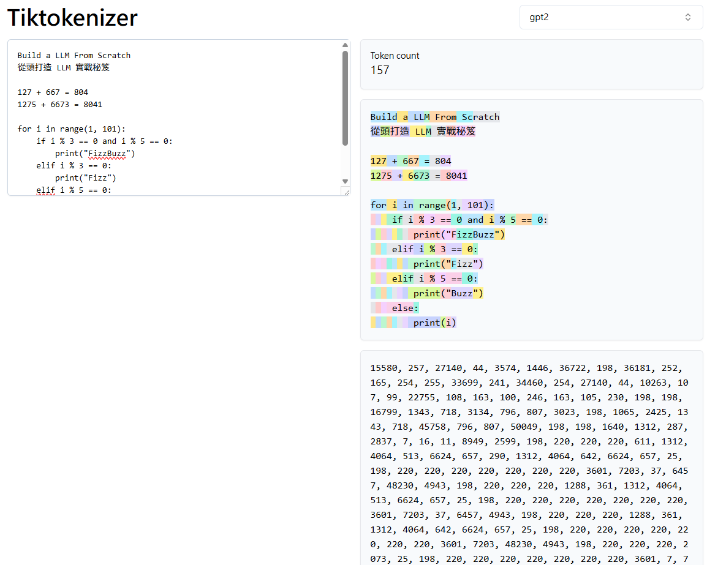

---
# try also 'default' to start simple
# theme: seriph
theme: default
# random image from a curated Unsplash collection by Anthony
# like them? see https://unsplash.com/collections/94734566/slidev
# background: https://cover.sli.dev
# some information about your slides (markdown enabled)
title: Twinkle AI 熬夜書坊 - Build LLM From Scratch ch2
info: |
  Twinkle AI 熬夜書坊 - 從頭打造 LLM 實戰秘笈
  Twinkle AI Study Group - Build LLM From Scratch ch2
# https://sli.dev/features/drawing
drawings:
  enabled: false
  # persist: false
  # syncAll: true
addons:
  - fancy-arrow
# slide transition: https://sli.dev/guide/animations.html#slide-transitions
transition: slide-left
# enable MDC Syntax: https://sli.dev/features/mdc
mdc: true
---


<h1 flex="~ col">
  <div flex text-2xl origin-top-left transition duration-500 :class="$clicks <= 2 ? 'scale-150' : 'op50'">
    <div flex="~ gap-2" duration-500 v-click>
      
      Twinkle AI 之
    </div>
    <div duration-500 :class="$clicks <= 0 ? 'text-4xl ml-10' : ''">熬夜書坊 </div>
    <sup v-click>2/n</sup>
  </div>
  <div mt-1 v-click>Build a LLM from scratch</div>
  <div mt-8 flex="~ gap-2" transition duration-500 v-click>
    
    <div text-2xl >導讀人<br>Bbson (Bobson Lin)</div>
  </div>
</h1>


<!-- 
https://raw.githubusercontent.com/antfu/talks/refs/heads/main/2024-02-29/src/slides.md 
-->


---
transition: fade-out
layout: full
---

# 行前通知
<p flex="~ gap-2">打預防針時間<div i-ph:syringe-bold text-xl></div></p>

<v-clicks>

### ❌ 不會 照小節順序

### ✨ 會有 個人補充 + 程式碼 + 一些些 數學 + 一點點點 演算法

參考資料: https://notebooklm.google.com/notebook/dc566599-aeb3-41ee-abc4-188794473a0a

<div flex="~ gap-4">
<div>Big Shout out to ...</div>

<a href="https://youtube.com/playlist?list=PLTKMiZHVd_2IIEsoJrWACkIxLRdfMlw11&si=w2KrNOS3GJoBZQMF" target="_blank">
  
</a>
</div>

</v-clicks>

---
transition: fade-out
layout: full
---

# 幾個問題

<br>

<div flex="~ col">
  <div flex="~ gap-2 items-center">
    <div flex="~ gap-2 items-center" v-click>
      <div i-ph:book-open-text-duotone text-3xl />
      <span font-bold text-3xl>要怎麼讓模型「看懂」文字？</span>
    </div>
  </div>


  <div flex="~ gap-2 items-center" mt-16>
    <div flex="~ gap-2 items-center" v-click>
      <div i-ph:tree-structure-duotone text-3xl />
      <span font-bold text-3xl>要怎麼讓模型「學會語言的結構」？</span>
    </div>
  </div>


  <div flex="~ gap-2 items-center" mt-16>
    <div flex="~ gap-2 items-center" v-click>
      <div i-ph:list-numbers-duotone text-3xl />
      <span font-bold text-3xl>要怎麼讓模型「知道順序」？</span>
    </div>
  </div>

</div>


<style>
h1 {
  background-color:rgb(182, 145, 43);
  background-image: linear-gradient(45deg,rgb(203, 212, 78) 10%,rgb(140, 102, 20) 20%);
  background-size: 100%;
  -webkit-background-clip: text;
  -moz-background-clip: text;
  -webkit-text-fill-color: transparent;
  -moz-text-fill-color: transparent;
}
</style>

<!--
今天先用三個問題來串起今天的內容

看懂文字: 為了讓模型能讀我們的文本
學會語言的結構: 不只懂詞，還要看出句子裡前後文，句子說甚麼。
知道順序: 同樣的詞不同排列會變成不同意思，模型必須分辨先後脈絡。
-->

---
transition: fade-out
layout: two-cols-header
---

<h1 font-bold flex="~ gap-2"> <div i-ph:book-open-text-duotone></div> <span v-mark="{color:'#ffd500', strokeWidth:3}">要怎麼讓模型「看懂」文字？</span> </h1>

::left::

<br>

<v-click>

## **表示/表示法 Representaion**

</v-click>

<div flex="~ gap-4 items-center" my-4>

<div text-2xl mr-8 v-click>人類</div>

<div i-tabler:language text-4xl v-click />
<div i-tabler:math-symbols text-4xl v-click />
<div i-tabler:music text-4xl v-click />
<div i-tabler:library-photo text-4xl v-click />

</div>

<v-click>
<hr>
</v-click>

<div flex="~ gap-4 items-center" my-4>

<div text-2xl mr-8 v-click>機器</div>

<div i-carbon:chart-multitype text-4xl v-click/>
<div i-carbon:data-blob text-4xl v-click/>

</div>

<br>

<v-click>

## **將文字資料轉換數字/向量**

</v-click>

<ol my-4>
  <li v-click="15">詞元切分 (Tokenization)</li>
  <li v-click="16">編碼/解碼 (Encode/Decode)</li>
  <li v-if="$clicks == 17">嵌入 (Embedding)</li>
  <li v-click="18" :class="$clicks >= 18 ? 'op-25' : 'hidden' ">嵌入 (Embedding)</li>
</ol>

::right::

<div flex="~ justify-center" w-full v-click="13">
=14 ? 'scale-180 origin-bottom mask' : ''"
 src="/images/GPT%20Model%20Layers%20Diagram%20Focus.png" alt="">
</div>


<style>
.mask {
    mask: linear-gradient(180deg, transparent 200px, #000 0);
    /* mask-size: 60% 50%;
    mask-repeat: no-repeat; */
}
</style>

<!-- 

講者 Notes｜要怎麼讓模型「看懂」文字？

首先，人類和機器對於這世界的表示法有很大的差異

人類:
* 的語言透過 聲音/文字 來傳達思想
* 有數學利用符號來進行抽象關係的思考找出規律
* 製作音樂來表達情感
* 創作來來幫助回憶

機器:
* 只懂 Data 資料
* 準確來說是 0和1 數字

人類和機器擅長的表示法不同，我們和機器之間也要有一層轉換
在現今的 LLM ,我們的任務是把文字「表示」成機器可處理的數值表示。

先看一張圖，這是之後 ch5 

[Click]詞元切分 Tokenization <Drawing>


回答第一個問題，會先講解第1和2

-->

---
transition: fade-out
layout: full
---

# 詞元切分 (Tokenization)

<v-clicks>

<div text-xl> 將原始文本分解為較小的處理單元，稱為詞元 (tokens)</div>

將文本([The Verdict](https://en.wikisource.org/wiki/The_Verdict))依照空白做切分


```python {hide|none|1-2|1-5|all}{lines:true}
with open("the-verdict.txt", "r", encoding="utf-8") as f:  # 讀取 The Verdict 文本
    raw_text = f.read()

preprocessed = re.split(r'([,.:;?_!"()\']|--|\s)', raw_text)  # 按照正則把 raw_text 切成片段
preprocessed = [item.strip() for item in preprocessed if item.strip()]  # 去除空白，避免產生空 token

print(len(reprocessed))
print(preprocessed[:30])
```

</v-clicks>

<v-clicks>

``` log
4690
['I', 'HAD', 'always', 'thought', 'Jack', 'Gisburn', 'rather', 'a', 'cheap', 'genius', '--', 'though', 'a', 'good',
'fellow', 'enough', '--', 'so', 'it', 'was', 'no', 'great', 'surprise', 'to', 'me', 'to', 'hear', 'that', ',', 'in']
```

</v-clicks>

<!-- 
詞元切分 就是 將原始文本分解為較小的處理單元，稱為詞元 (tokens)

直覺，按照書裡的範例程式碼
 -->

---
transition: fade-out
layout: two-cols-header
---

# 編碼/解碼 (Encode/Decode) 


<div text-xl mb-2 v-click> 透過建立一個 <span font-bold> 詞彙表 (Vocabulary)</span> 來實現 詞元 (Token) 到 整數 (Token ID) 的映射關係 </div>


::left::

<div flex="~ col gap-4 items-center" my-2>


<div text-xl v-click> Vocabulary </div>

</div>


::right::

```python {hide|all|1-4|1-12|1-17|all}{lines:true}
class SimpleTokenizerV1:
    def __init__(self, vocab):
        self.str_to_int = vocab  # 詞彙表 (Vocabulary)
        self.int_to_str = {i:s for s,i in vocab.items()}  # 詞彙表 (Vocabulary)

    def encode(self, text):  # 編碼 ； Token == encode => Token ID
        preprocessed = re.split(r'([,.:;?_!"()\']|--|\s)', text)
        preprocessed = [
            item.strip() for item in preprocessed if item.strip()
        ]
        ids = [self.str_to_int[s] for s in preprocessed]
        return ids

    def decode(self, ids):  # 解碼 ; Token ID == decode => Token
        text = " ".join([self.int_to_str[i] for i in ids])
        text = re.sub(r'\s+([,.?!"()\'])', r'\1', text)
        return text
```
<div text-xl my-2 v-click>這樣就完成了 <span :class="$clicks <=10 ? 'hidden' : ''">嗎!?</span></div>

<div text-xl v-click="12"> SimpleTokenizer is way too simple ... </div>


<!--
透過建立一個  詞彙表 (Vocabulary)

SimpleTokenizer 還有些特殊的情形要處理:
Hello 這個詞不在 The Verdict 文本裡
出現一個不認識的詞只能標成 UNK

這樣會造成甚麼問題呢?
-->


---
transition: fade-out
layout: full
---

# Tokenizer (分詞器)

<v-clicks>

> Tokenization is my least favorite part of working with large language models but unfortunately it is necessary to understand in some detail ...   標記化是我在使用大型語言模型時最不喜歡的部分，但不幸的是，有必要詳細了解它  ...  
> -- From **Andrej Karpathy [Let's build the GPT Tokenizer](https://youtu.be/zduSFxRajkE?list=TLGGSLuehg7u_WcyNjEwMjAyNQ)**

| 類型                    | 優點                                  | 缺點                                            | 原理／說明                           | 代表性算法／應用                                                    |
| --------------------- | ----------------------------------- | --------------------------------------------- | ------------------------------- | ----------------------------------------------------------- |
| 基於單詞（Word-based）      | 直觀、易於設置                             | 詞彙庫龐大、[UNK] 多、無法處理詞形變化（go/going/went） | 以「詞」為最小單位建立詞彙表；英文常以空白切分，中文需額外斷詞 | —                                                           |
| 基於字元（Character-based） | 詞彙庫極小、幾乎沒有未知詞                       | 語義單位過小、序列過長、訓練成本高                             | 以單一字元為單位編碼；可覆蓋任何文本              | —                                                           |
| 子詞（Subword-based）           | 兼顧詞與字元優點：詞彙庫適中、幾乎無 [UNK]、能保留語義與處理詞形 | 需要訓練子詞規則；實作較複雜                                | 常見詞完整保留；罕見詞拆為更小但有意義的子單元         | Byte-level [BPE](https://en.wikipedia.org/wiki/Byte-pair_encoding)（GPT-2）、WordPiece（BERT）、SentencePiece（常用於多模型） |


</v-clicks>


<style>
table tbody {
  font-size: 14px;
}
</style>


<!-- 
要知道這問題怎麼辦需要再了解一下分詞器

AI 大神 Andrej Karpathy，Tokenizer 相當的不好玩，而且很多 LLM 的問題就是因為分詞器影響的

圖表

BPE 演算法 & 實作 (補充) -->


---
transition: fade-out
layout: full
---

# 使用 tiktoken

<v-clicks>

```python {hide|none|1|1-3|1-7|1-11|1-14|all}{lines:true}
import tiktoken

tokenizer = tiktoken.get_encoding("gpt2")  # 用 GPT2 的分詞器

text = (
    "Hello, do you like tea? <|endoftext|> In the sunlit terraces"
     "of someunknownPlace."
)

encoded_list = tokenizer.encode(text, allowed_special={"<|endoftext|>"})
print(encoded_list)

decoded_string = tokenizer.decode(encoded_list)
print(decoded_string)
```


``` log
[15496, 11, 466, 345, 588, 8887, 30, 220, 50256, 554, 262, 4252, 18250, 8812, 2114, 1659, 617, 34680, 27271, 13]
Hello, do you like tea? <|endoftext|> In the sunlit terracesof someunknownPlace.
```

</v-clicks>


---
transition: fade-out
layout: full
---

# Tiktokenizer

https://tiktokenizer.vercel.app/?model=gpt2



<!-- 
Build a LLM From Scratch
從頭打造 LLM 實戰秘笈

127 + 667 = 804
1275 + 6673 = 8041

for i in range(1, 101):
    if i % 3 == 0 and i % 5 == 0:
        print("FizzBuzz")
    elif i % 3 == 0:
        print("Fizz")
    elif i % 5 == 0:
        print("Buzz")
    else:
        print(i)

GPT2 的 Tokenizer 也存在些問題：
非英文
數學
程式碼
 -->


---
transition: fade-out
layout: full
---

<h1 font-bold flex="~ gap-2"> <div i-ph:tree-structure-duotone></div> <span v-mark="{color:'#ffd500', strokeWidth:3}">要怎麼讓模型「學會語言的結構」？</span> </h1>


<div text-2xl v-click><span font-bold>嵌入 (Embedding)</span> 的本質是一種將 <span font-bold>離散物件</span> <span font-bold>映射</span> 到連續 <span font-bold>向量空間</span> 的方法</div>

<div mt-12 w-60 ml-80 text-2xl text-red-400 font-bold transition duration-500 v-click="5">Word Embedding</div>

<div flex="~ gap-64" mt-2>

<div flex="~ col gap-2 justify-center items-center" data-id="raw-text" v-click>
  <div i-carbon:document-multiple-01 text-8xl />
  <div>Raw Text</div>
</div>

<FancyArrow v-click="5" forward:delay-100 q1="[data-id=raw-text]" pos1="right" q2="[data-id=embedding-vector]" pos2="left" color="red" width="4" arc="-0.1" seed="1" roughness="5" >
  
</FancyArrow>

<div flex="~ col gap-2 justify-end items-center" data-id="embedding-model" v-click="4">
<div i-carbon:foundation-model text-8xl mt-4/>
  <div>Embedding Model/Layer</div>
</div>

<!-- <FancyArrow v-click="2" forward:delay-100 q1="[data-id=embedding-model]" pos1="right" q2="[data-id=embedding-vector]" pos2="left" color="red" width="2" seed="1" roughness="5" >
</FancyArrow> -->

<div flex="~ col gap-2 justify-center items-center" data-id="embedding-vector" v-click="3">
  <div i-ph:vector-three text-8xl />
  <div>Eembedding Vector/Matrix</div>
</div>


</div>


<!-- ## 詞嵌入 (Word Embeddings)

文字(分詞後) => (詞)嵌入 (Word) Embedding => (嵌入)向量 (Eembedding Vector) -->


---
transition: fade-out
layout: two-cols
---


# 詞嵌入的小歷史
NLP 小歷史(?


<br>


<div flex="~ col gap-4 mt-8">

<h4 v-click="1">BoW (Bag of Words) / TF-IDF</h4>

<div i-ph-arrow-down op50 ml-1 text-sm v-click="2" />

<h4 v-click="3">
  <a href="https://arxiv.org/pdf/1301.3781" target="_blank">Word2Vec</a> / <a href="https://nlp.stanford.edu/projects/glove/" target="_blank">GloVe</a> / <a href="https://github.com/facebookresearch/fastText" target="_blank">FastText</a>
</h4>

<div i-ph-arrow-down op50 ml-1 text-sm v-click="7" />

<h4 v-click="7">ELMo / BERT / GPT</h4>


</div>


::right::


<blockquote v-click="4">
  <p>Word2Vec: 透過轉換成向量空間能更好的捕捉詞彙之間的 <span font-bold>語義關係</span> 和 <span font-bold>相似性</span> </p>
</blockquote>


<a v-click="5" href="https://www.deeplearningillustrated.com/" target="_blank" text-base>https://www.deeplearningillustrated.com/</a>

<a v-click="6" href="https://lamyiowce.github.io/word2viz/" target="_blank" text-base>https://lamyiowce.github.io/word2viz/</a>


---
transition: fade-out
layout: two-cols-header
---


# 創建詞元嵌入層 (Token Embedding Layer)

::left::

<div w-90>

</div>

::right::

<v-clicks>

``` python {hide|none|1-4|1-8|1-11|1-14|all}{lines:true}
import torch

vocab_size = 6
output_dim = 3
inputs = torch.tensor([2, 3, 5, 1])

token_embedding_layer = torch.nn.Embedding(vocab_size, output_dim)  # 建立嵌入層
print(token_embedding_layer.weight, token_embedding_layer.weight.shape)

token_embeddings = token_embedding_layer(inputs)  # 查閱操作 (Lookup Operation)
print(token_embeddings, token_embeddings.shape)
```

``` log
Parameter containing:
tensor([[ 0.3374, -0.1778, -0.1690],
        [ 0.9178,  1.5810,  1.3010],
        [ 1.2753, -0.2010, -0.1606],
        [-0.4015,  0.9666, -1.1481],
        [-1.1589,  0.3255, -0.6315],
        [-2.8400, -0.7849, -1.4096]], requires_grad=True)

tensor([[ 1.2753, -0.2010, -0.1606],
        [-0.4015,  0.9666, -1.1481],
        [-2.8400, -0.7849, -1.4096],
        [ 0.9178,  1.5810,  1.3010]], grad_fn=<EmbeddingBackward0>)
```

</v-clicks>

<!--  -->

---
transition: fade-out
layout: full
---

<h1 font-bold flex="~ gap-2"> <div i-ph:list-numbers-duotone></div> <span v-mark="{color:'#ffd500', strokeWidth:3}">要怎麼讓模型「知道順序」？</span> </h1>


<div flex="~ gap-2" class="mt-12" text-3xl v-click>
  <div >我愛台妹</div> <div i-ph:equals-bold v-mark="{at: 3, type: 'crossed-off'}"></div> <div >台妹愛我</div>
</div>

<br>

<v-clicks>

模型無法感知詞元在序列中的 **絕對位置** 或 **相對位置**

$Input\ Embedding=Token\ Embedding+Positional\ Embedding$

OpenAI GPT 用的是 **絕對位置** 嵌入

</v-clicks>


<style>
.slidev-vclick-target {
  transition: all 500ms ease;
}

</style>


<!-- 
詞元嵌入向量送入模型之前，會額外添加位置資訊

* 機制： 額外訓練一個位置嵌入層（Position Embedding Layer），該層根據詞元在序列中的索引（例如 0, 1, 2, ...）產生一個對應的向量。
* 結合方式： 這個位置向量會直接與詞嵌入向量相加，生成最終的輸入嵌入。
  Input Embedding=Token Embedding+Positional Embedding
* 效果： 即使同一個詞元（擁有相同的 Token Embedding）出現在序列的不同位置，由於它們的位置編碼不同，最終輸入到 Transformer 的向量也會不同。
-->

---
transition: fade-out
layout: two-cols-header
---

# 加上絕對位置嵌入層 (Position Embedding Layer) - I

::left::

<div w-96>

</div>

::right::

<v-clicks>

``` python
import torch

vocab_size = 6
output_dim = 3
inputs = torch.tensor([2, 3, 5, 1])
context_length = 4

token_embedding_layer = torch.nn.Embedding(vocab_size, output_dim)  # 建立詞嵌入層
print(token_embedding_layer.weight, token_embedding_layer.weight.shape)

token_embeddings = token_embedding_layer(inputs)  # 查閱操作 (Lookup Operation)
print(token_embeddings, token_embeddings.shape)

pos_embedding_layer = torch.nn.Embedding(context_length, output_dim)  # 建立位置嵌入層
print(pos_embedding_layer.weight, pos_embedding_layer.weight.shape)

pos_embeddings = pos_embedding_layer(torch.arange(context_length))
print(pos_embeddings, pos_embeddings.shape)

input_embeddings = token_embeddings + pos_embeddings  # 詞嵌入與位置嵌入相加
print(input_embeddings, input_embeddings.shape)
```

</v-clicks>

---
transition: fade-out
layout: two-cols-header
---

# 加上絕對位置嵌入層 (Position Embedding Layer) - II

::left::

<div w-96>
  
</div>

::right::

<v-clicks>

``` log {maxHeight:'100px'}
========== Token Embedding Layer ==========
Parameter containing:
tensor([[ 1.3026, -0.4288,  0.1233],
        [ 1.6076,  1.1366,  0.9089],
        [ 0.9494,  0.0266, -0.9221],
        [ 0.7034,  0.8656,  0.5044],
        [-0.9207,  0.3154, -0.0217],
        [ 0.3441,  0.2271, -0.4597]], requires_grad=True) torch.Size([6, 3])
tensor([[ 0.9494,  0.0266, -0.9221],
        [ 0.7034,  0.8656,  0.5044],
        [ 0.3441,  0.2271, -0.4597],
        [ 1.6076,  1.1366,  0.9089]], grad_fn=<EmbeddingBackward0>) torch.Size([4, 3])
========== Position Embedding Layer ==========
Parameter containing:
tensor([[-0.7372,  1.5757,  0.1620],
        [ 0.8864, -1.0289,  0.0656],
        [ 0.2447, -1.9013, -1.8635],
        [ 0.1906, -0.6479, -0.8922]], requires_grad=True) torch.Size([4, 3])
tensor([[-0.7372,  1.5757,  0.1620],
        [ 0.8864, -1.0289,  0.0656],
        [ 0.2447, -1.9013, -1.8635],
        [ 0.1906, -0.6479, -0.8922]], grad_fn=<EmbeddingBackward0>) torch.Size([4, 3])
========== Input Embedding Layer ==========
tensor([[ 0.2123,  1.6022, -0.7600],
        [ 1.5898, -0.1633,  0.5700],
        [ 0.5889, -1.6742, -2.3232],
        [ 1.7982,  0.4887,  0.0167]], grad_fn=<AddBackward0>) torch.Size([4, 3])
```

</v-clicks>

---
transition: fade-out
layout: full
---

# Take Away

<br>

<div flex="~ col">
  <div flex="~ gap-2 items-center">
    <div flex="~ gap-2 items-center" v-click>
      <div i-ph:book-open-text-duotone text-3xl />
      <span font-bold text-3xl>要怎麼讓模型「看懂」文字？</span>
    </div>
  </div>
  <div flex="~ gap-2 items-center" ml-8 text-xl op80 v-click>
    <div i-ph-arrow-bend-down-right-duotone op50 />
    <div>
      詞元切分 (Tokenization) + 建立詞彙表(Vocabulary) 編碼/解碼 (Encode/Decode) + 嵌入 (Embedding)
    </div>
  </div>

  <div flex="~ gap-2 items-center" mt-16>
    <div flex="~ gap-2 items-center" v-click>
      <div i-ph:tree-structure-duotone text-3xl />
      <span font-bold text-3xl>要怎麼讓模型「學會語言的結構」？</span>
    </div>
  </div>
  <div flex="~ gap-2 items-center" ml-8 text-xl op80 v-click>
    <div i-ph-arrow-bend-down-right-duotone op50 />
    <div>
      文本 (Raw Text) -> 詞嵌入 (Word Embedding) -> 詞嵌入向量 (Word Embedding Vectors)
    </div>
  </div>

  <div flex="~ gap-2 items-center" mt-16>
    <div flex="~ gap-2 items-center" v-click>
      <div i-ph:list-numbers-duotone text-3xl />
      <span font-bold text-3xl>要怎麼讓模型「知道順序」？</span>
    </div>
  </div>
  <div flex="~ gap-2 items-center" ml-8 text-xl op80 v-click>
    <div i-ph-arrow-bend-down-right-duotone op50 />
    <div>
      詞嵌入向量 + 位置嵌入向量 = 輸入向量
    </div>
  </div>
</div>


<style>
h1 {
  background-color:rgb(182, 145, 43);
  background-image: linear-gradient(45deg,rgb(203, 212, 78) 10%,rgb(140, 102, 20) 20%);
  background-size: 100%;
  -webkit-background-clip: text;
  -moz-background-clip: text;
  -webkit-text-fill-color: transparent;
  -moz-text-fill-color: transparent;
}
</style>
